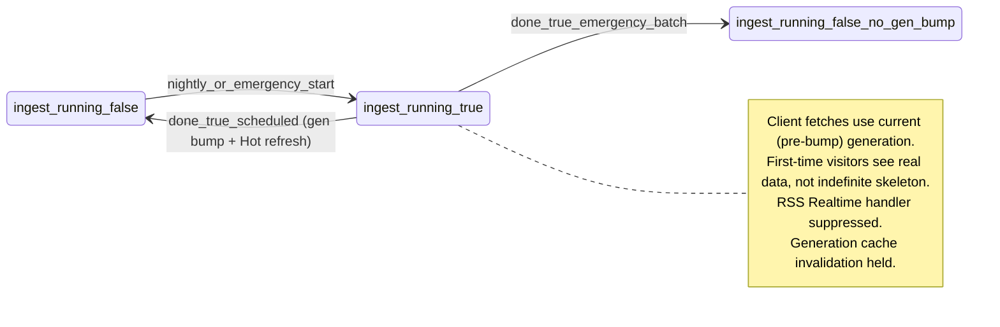

# Atomic previous-day catalog until nightly ingest completes

## Locked product decisions (pre-build)

1. **Automation (no routine human catalog runs):** Day-to-day catalog is **only** the **scheduled nightly** tcgcsv/TCGPlayer ingest (e.g. `[.github/workflows/tcgcsv-catalog-cron.yml](.github/workflows/tcgcsv-catalog-cron.yml)`). **No** in-app operator button for routine full-catalog refresh. **Hidden / ops-only emergency** paths exist for **failed batches** after an unsuccessful nightly, and an **optional full nightly rerun** when the scheduled run **explicitly did not happen** (document API: e.g. cron secret + body flag `fullNightlyRerun`).
2. **`tcgcsv_catalog_generation` + Hot snapshot:** Bump **only** on **successful completion** of either (a) the **scheduled nightly** orchestration (`done: true` with cron auth) or (b) an **optional full nightly rerun** when cron explicitly did not run (same auth + `fullNightlyRerun`-style contract). **Emergency batch repair** and **failed-slice retries** **do not** bump generation or rewrite `dashboard_hot_movers`.
3. **`tcgcsv_ingest_running` (generation gate, not fetch gate):** Set `true` at the start of **both** (a) the **scheduled nightly** multi-batch run and (b) **hidden emergency batch** repair runs that call the same ingest endpoint. Set `false` on each ingest response's terminal boundary for that run (`done: true` **or** aborted failure path—document so ops is never stuck). While `true`, the client **does not invalidate** generation-scoped cache or bump to a new generation — but **catalog fetches still execute** using the current (pre-bump) `generation` value from the RPC, which represents the last committed stable snapshot. **First-time visitors (no cache) read the same stable generation normally and see real data, never an indefinite skeleton.** The gate is: hold the generation bump until `ingest_running = false`, not hold all reads. Scheduled or full nightly rerun `done: true` runs the **Hot + generation** transaction (**Locked #2**). Emergency batch-only `done: true` **only** sets `ingest_running = false` (no generation or Hot change).
4. **`dashboard_hot_movers`:** Refreshed **only** in the same DB transaction as **Locked #2** (generation bump on successful scheduled or full-rerun completion). **Acknowledged tradeoff:** if a nightly ingest produces bad TCGplayer snapshot data (e.g. a tcgcsv.com data quality issue), the resulting incorrect hot/cold rankings **cannot be corrected by emergency batch repair** — the fix requires either the next scheduled nightly or a manual full nightly rerun. Incorrect hot/cold data may persist up to ~24 hours. This is acceptable by design; ops must not attempt to correct hot rankings via eBay-side workarounds.
5. **eBay sold comps on dashboard:** **Live cells** via a **separate** query/state path; **never** invalidate **Hot** or **catalog-generation–keyed** default grid queries.
6. **`pokemon_card_images` Realtime:** **Remove** `public.pokemon_card_images` from `supabase_realtime`. Remove `pokemon_card_images_changes` from [`PokemonDashboard.tsx`](listing-admin/src/PokemonDashboard.tsx). TCGplayer-backed catalog columns on the dashboard refresh **after generation bump** or **user filters / pagination**, not WAL.
7. **`market_rss_cards` Realtime:** **Debounced** handler refetches **current-page** grid rows (**full rows**) with **fixed TCGplayer `ORDER BY`** — **and nothing else**: it must **not** call `loadSeries`, `loadCardSetsForSeries`, or `loadRarities`. The handler is **suppressed entirely when `ingest_running = true`** (client is already on the stable generation; eBay writes during this window do not affect the display). **Server-side coalescing or batching on `market_rss_cards` writes is a required deliverable** (not "where feasible") before or alongside client Realtime changes; this is the primary mechanism for reducing WAL event flood.
8. **Hot 24 strip vs default grid — no duplication:** `dashboard_hot_movers` provides the top 24 card IDs. The default grid query **always adds a `NOT IN (hot card IDs)` filter** so that Hot strip cards never appear again in the main grid. The Hot strip and the default grid are exclusive sets.

## MVP client stack

- **TanStack Query + persistence (IndexedDB)** in **MVP** for **Hot** and **default grid** queries; **dehydrate** keys that include `tcgcsv_catalog_generation`. Wrap app in [`listing-admin/src/main.tsx`](listing-admin/src/main.tsx) or [`App.tsx`](listing-admin/src/App.tsx) with `QueryClientProvider` + `persistQueryClient` (exact packages per implementation pass).

## Scope (explicit)

- **In scope:** [`listing-admin/src/PokemonDashboard.tsx`](listing-admin/src/PokemonDashboard.tsx) — load, refresh, filters, search; generation status RPC; persist; realtime split.
- **Out of scope:** [`listing-admin/src/CardDetailPage.tsx`](listing-admin/src/CardDetailPage.tsx) behavior unchanged unless noted; no global Supabase middleware.

## Daily list consistency

- Same **ranked list** for a given `tcgcsv_catalog_generation` for all users; persist is cache-only.
- **TCGplayer nightly** defines Hot order and default grid `ORDER BY`; eBay does not re-rank.
- **Hot 24 cards are excluded from the default grid** (`NOT IN` filter on Hot IDs) — no card appears in both the Hot strip and the main grid.

## Requirement

During `tcgcsv_ingest_running === true` (scheduled **or** emergency repair), the client **does not bump or invalidate** the generation-scoped cache. Catalog fetches **continue to execute** using the current (pre-bump) stable `generation` from `listing_catalog_status()`. This avoids mixed reads mid-batch on [`pokemon_card_images_with_market_activity`](supabase/migrations/20260507120000_tcgplayer_snapshot_delta_in_view.sql) while guaranteeing that even first-time visitors see real data rather than an indefinite skeleton.

---

## Server: `listing_catalog_meta` + ingest

| Column                      | Purpose                                                                                             |
| --------------------------- | --------------------------------------------------------------------------------------------------- |
| `tcgcsv_catalog_generation` | Bumps **only** on **scheduled** (or **full nightly rerun**) successful completion                   |
| `tcgcsv_ingest_running`     | `true` during **scheduled nightly** or **emergency batch** ingest HTTP sequences; `false` when idle |

**[`pokemon-card-images-ingest`](supabase/functions/pokemon-card-images-ingest/index.ts):**

- **Start:** set `ingest_running = true` for **cron-scheduled** and **authenticated emergency** invocations (detect via `x-cron-secret` and/or explicit body flags documented in README).
- **Scheduled / full-rerun `done: true`:** one transaction: refresh `dashboard_hot_movers`, then meta `ingest_running = false` + new `tcgcsv_catalog_generation`.
- **Emergency batch-only `done: true`:** set `ingest_running = false` only; **no** generation or Hot change.
- **`done: false`:** leave `ingest_running` true until final batch or explicit failure handling.

**RPC:** `listing_catalog_status()` → `{ generation, ingest_running }`.

`listing_catalog_meta` is **added to `supabase_realtime` publication** so the client receives a push event when `ingest_running` flips to `false` — no polling required.

---

## Client: gated fetch + realtime

- **Parallel startup:** on mount, fire `listing_catalog_status()` **and** attempt IndexedDB hydration at the same time (do not await the RPC before touching the cache). Render from cache immediately if generation matches. Validate against the RPC response in the background.
- **Ingest gate (generation bump only):** when `ingest_running === true`, hold cache invalidation — do not refetch on a generation mismatch. When `ingest_running` flips to `false` (via Realtime on `listing_catalog_meta`), then check generation and refetch if it changed.
- **First-time visitor (no cache) during `ingest_running = true`:** `generation` from the RPC is still the last committed stable value (the bump hasn't happened yet). Fetch normally using that generation. Show a skeleton only for the in-flight query duration, not as an open-ended gate.
- **Graceful degrade:** if `listing_catalog_status()` returns null or an error (e.g. migration not yet deployed), fall through to a direct catalog fetch with no generation gating — preserve current behavior.
- **Unified pagination:** first visit and returning both use `POKEMON_CARDS_PAGE_SIZE` (e.g. 30); **prefetch** next page after page 1 resolves for snappiness.
- Remove `pokemon_card_images` channel; split `market_sold_comps` (cells only) vs `market_rss_cards` (grid refetch, same `ORDER BY`, suppressed when `ingest_running = true`); see **Cleanup**.

---

## First-time vs returning (no smaller first page)

- **First visit (no persist), `ingest_running = false`:** skeleton for Hot + grid during in-flight queries only; **Hot 24** + main grid use **same page size** as returning; `prefetchQuery` for page 2.
- **First visit (no persist), `ingest_running = true`:** same as above — use the stable `generation` from the RPC to fetch the pre-bump catalog normally. User sees real data. Generation will not be bumped until ingest completes; client picks up the new generation via Realtime on `listing_catalog_meta` when `ingest_running` flips to `false`.
- **Returning:** hydrate from persist when generation matches; same page size.

---

## Cleanup and legacy alignment

Unchanged intent: split monolithic debounce (~619–666 in [`PokemonDashboard.tsx`](listing-admin/src/PokemonDashboard.tsx)); decouple `pokemonFilterBootstrapped` from first default grid fetch; **paint grid before awaiting** sold comps; loading copy; filter/search `ORDER BY` remains TCGplayer-only on default branch; tests.

Additionally: **remove `card_max_abs_price_delta_cents` and `card_price_delta_sign` from the grid `SELECT`** — these eBay BIN delta columns are fetched today (line 492) but are not rendered anywhere; removing them reduces query payload and eliminates any future temptation to use eBay data for ranking.

---

## Flow diagram

---

## Merge

- Persist + generation: **PokemonDashboard** only; **MVP** includes TanStack persist.
- **Page size:** unified; first-time speed = skeleton + Hot + prefetch, not fewer rows per page.
- **RSS:** client debounce (grid-only, suppressed during ingest) + **server coalescing required**.
- **Status RPC:** parallel with IndexedDB hydration; graceful degrade if unavailable.
- **Ingest completion signal:** Realtime on `listing_catalog_meta` (locked; not polling).

---

## Test contracts

These scenarios are part of the implementation contract and should be specified and then implemented alongside the related build steps.

**Scenario 1 — RPC graceful degrade** *(alongside step 4)*
- `listing_catalog_status()` returns `null` or throws -> client falls through to direct catalog fetch, no crash, no blank screen.

**Scenario 2 — First-time visitor during ingest** *(alongside step 5)*
- `ingest_running = true` with no IndexedDB cache -> client fetches using RPC `generation`; rows return; skeleton clears; no open-ended gate.

**Scenario 3 — Ingest edge function branch DB state** *(alongside step 2)*
- Scheduled `done: true` -> `ingest_running = false`, `generation` bumped, `dashboard_hot_movers` refreshed.
- Emergency batch `done: true` -> `ingest_running = false`, `generation` unchanged, `dashboard_hot_movers` unchanged.
- Any `done: false` batch -> `ingest_running = true`, no generation or Hot update.

**Scenario 4 — Hot 24 / grid exclusion** *(alongside step 5)*
- Default grid query returns zero card IDs that appear in `dashboard_hot_movers`.

**Scenario 5 — RSS handler isolation** *(alongside step 5)*
- A `market_rss_cards` Realtime event triggers `loadPokemonCards` (silent) only; `loadSeries`, `loadCardSetsForSeries`, and `loadRarities` are not called.

---

## Implementation order

> **Deployment dependency:** Step 1 (migration) **must be deployed before** step 4 (client changes). The client in step 4 must call `listing_catalog_status()` defensively and fall back to direct fetch if the RPC is absent or errors. Never deploy step 4 to an environment where step 1 has not run.

1. Migration: meta + Hot table + `dashboard_hot_movers` table + drop `pokemon_card_images` from publication + **add `listing_catalog_meta` to publication**.
2. Ingest: branching for **scheduled vs emergency batch** vs **full rerun**; `ingest_running` + generation/Hot transaction rules above; document stuck-running reset path for ops.
3. **Server:** `market_rss_cards` write coalescing / batching (required; deliver alongside or before step 4).
4. **TanStack Query + persist MVP** in listing-admin; query keys include generation; parallel RPC + hydration startup; graceful degrade.
5. **PokemonDashboard:** gates (generation bump held during ingest, not fetch gate); remove `pokemon_card_images` channel; split realtime handlers (RSS: grid-only + suppressed during ingest; sold comps: cell-only); unified page size; first-view skeleton + prefetch; remove unused eBay delta columns from SELECT; Hot 24 strip with `NOT IN` grid exclusion; cleanup section.
6. README / ops: cron, emergency API, stuck `ingest_running`, no routine manual UI, hot/cold data quality tradeoff (bad nightly requires next nightly or full-rerun to correct — no eBay workarounds).
7. Implement test scenarios from **Test contracts** section + ops recovery doc.
